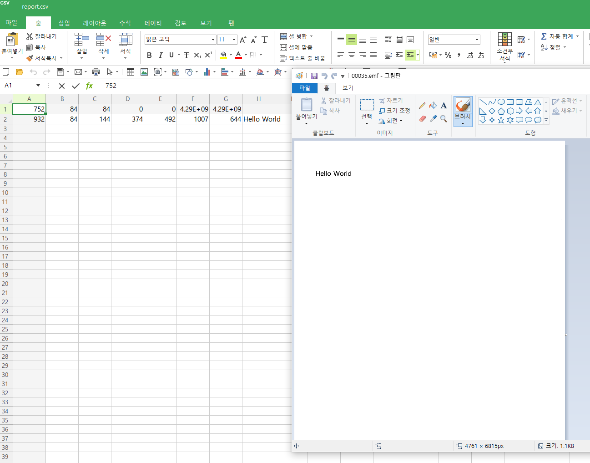

# EMF-Viewer
Parse text data from emf-spl file

How to make package? [Reference.](https://docs.microsoft.com/ko-kr/nuget/quickstart/create-and-publish-a-package-using-visual-studio-net-framework)

How it works? [Reference.](https://docs.microsoft.com/en-us/openspecs/windows_protocols/ms-emfspool/16f8b617-2113-42d4-a755-966461d82356)

